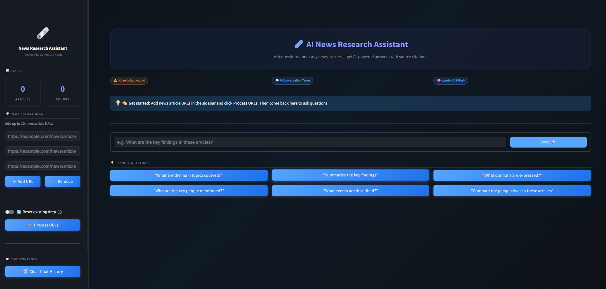
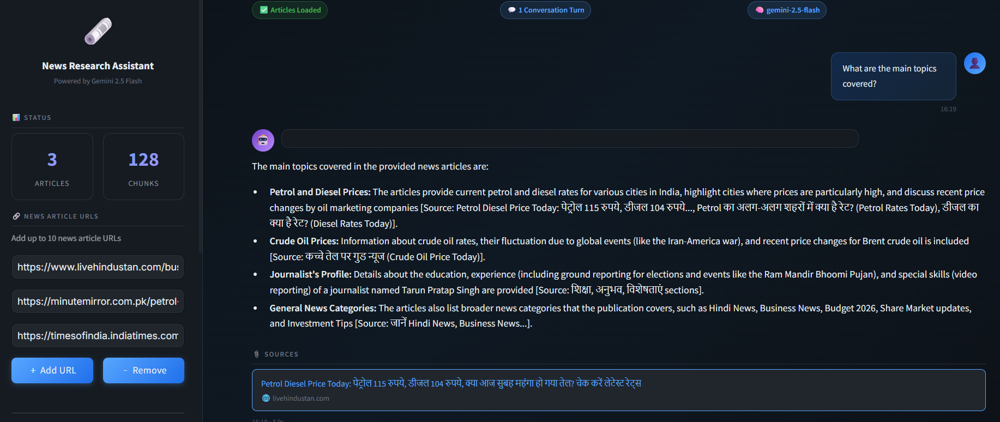

# 🗞️ AI News Research Assistant

> **Production-ready RAG application** — Ask questions about any news articles using Google Gemini 2.5 Flash, local HuggingFace embeddings, ChromaDB vector search, and LangChain.

🟢 **Live Demo:** [news-rag-assistant.streamlit.app](https://news-rag-assistant.streamlit.app/)


---

## 📸 Screenshots

<p align="center">
  
  &nbsp; &nbsp;
  
</p>

---

## ✨ Features

| Feature | Details |
|---------|---------|
| 🔗 **Multi-URL Ingestion** | Accept up to 10 news article URLs per session |
| 🧠 **Gemini 2.5 Flash** | Latest Google LLM for fast, accurate answers |
| 🔍 **Semantic Search** | Local HuggingFace embeddings (`all-MiniLM-L6-v2`) + ChromaDB similarity retrieval — no API quota! |
| 💬 **Conversation Memory** | Multi-turn chat with history-aware retrieval |
| 📎 **Source Citations** | Every answer links back to the originating article |
| 💾 **Persistent Storage** | ChromaDB persists across restarts |
| 🖥️ **Modern UI** | Premium dark-theme Streamlit dashboard |
| ⚡ **REST API** | Full FastAPI backend with Swagger UI |
| 🧪 **Test Suite** | Pytest unit + integration tests |
| 📋 **Logging** | Loguru structured logging with file rotation |

---

## 🏗️ Architecture

```
┌─────────────────────────────────────────────────────────┐
│                   Streamlit Frontend (app.py)           │
│   - Premium dark-theme chat UI                          │
│   - Sidebar URL management + progress indicators        │
│   - Source citation cards                               │
└────────────────────────┬────────────────────────────────┘
                         │ Direct Python calls
┌────────────────────────▼────────────────────────────────┐
│                 RAG Pipeline (backend/)                  │
│                                                         │
│  loader.py ──► chunker.py ──► vectorstore.py            │
│     │               │              │                    │
│  Requests +    RecursiveChar   ChromaDB                 │
│  BeautifulSoup  TextSplitter   Persistent               │
│                                                         │
│  embeddings.py ──────────────────────────               │
│  HuggingFace sentence-transformer   │
│                                                         │
│  rag_pipeline.py ────────────────────────               │
│  History-Aware Retrieval + Gemini 2.5 Flash             │
│                                                         │
│  prompts.py     config.py     utils.py                  │
└────────────────────────┬────────────────────────────────┘
                         │ Optional HTTP
┌────────────────────────▼────────────────────────────────┐
│                FastAPI REST API (api.py)                 │
│   POST /process-urls  │  POST /ask  │  GET /health      │
│   Swagger UI: http://localhost:8000/docs                 │
└─────────────────────────────────────────────────────────┘
```

---

## 📁 Project Structure

```
news-research-assistant/
│
├── app.py                    # Streamlit frontend
├── api.py                    # FastAPI backend
├── requirements.txt          # Python dependencies
├── pyproject.toml            # Pytest + coverage config
├── .env.example              # Environment variable template
├── README.md
│
├── backend/
│   ├── __init__.py
│   ├── config.py             # Pydantic Settings (env vars)
│   ├── loader.py             # URL fetching + HTML parsing
│   ├── chunker.py            # Document splitting
│   ├── embeddings.py         # HuggingFace local embeddings wrapper
│   ├── vectorstore.py        # ChromaDB operations
│   ├── rag_pipeline.py       # RAG orchestration + LLM
│   ├── prompts.py            # Prompt templates
│   └── utils.py              # Shared helpers + logging
│
├── chroma_db/                # Persisted vector embeddings (auto-created)
├── logs/                     # Application logs (auto-created)
├── assets/                   # Static assets
│
└── tests/
    ├── __init__.py
    ├── test_utils.py         # URL validation, text cleaning
    ├── test_chunker.py       # Document chunking
    ├── test_loader.py        # Article loading (mocked HTTP)
    └── test_api.py           # FastAPI endpoints (mocked pipeline)
```

---

## 🚀 Quick Start

### 1. Prerequisites

- Python 3.12+
- [Google AI Studio API Key](https://aistudio.google.com/app/apikey) (free — only needed for Gemini LLM answers, **not** for embeddings)
- ~500 MB disk space for the local embedding model (downloaded automatically on first run)

### 2. Clone & Setup

```bash
# Navigate to the project directory
cd news-research-assistant

# Create a virtual environment
python -m venv venv

# Activate (Windows PowerShell)
.\venv\Scripts\Activate.ps1

# Activate (macOS / Linux)
source venv/bin/activate

# Install dependencies
pip install -r requirements.txt
```

### 3. Configure Environment

```bash
# Copy the example env file
copy .env.example .env        # Windows
cp .env.example .env          # macOS / Linux

# Edit .env and add your Google API key
# GOOGLE_API_KEY=your_actual_api_key_here
```

### 4. Run the Streamlit App

```bash
streamlit run app.py
```

Open http://localhost:8501 in your browser.

### 5. Run the FastAPI Backend (Optional)

```bash
python api.py
# or
uvicorn api:app --host 0.0.0.0 --port 8000 --reload
```

- API Docs: http://localhost:8000/docs
- ReDoc: http://localhost:8000/redoc

---

## 🎯 How to Use

### Streamlit UI

1. **Add URLs** — Enter up to 10 news article URLs in the sidebar text fields.
2. **Process URLs** — Click **⚡ Process URLs** to fetch, chunk, embed, and store the articles.
3. **Ask Questions** — Type questions in the chat box or click an example question.
4. **View Sources** — Each AI answer includes clickable source citations.
5. **Continue the conversation** — Follow-up questions automatically use conversation history.
6. **Clear & Reset** — Use **🗑️ Clear Chat History** or toggle **Reset existing data** for a fresh start.

### FastAPI REST API

**Process URLs:**
```bash
curl -X POST "http://localhost:8000/process-urls" \
  -H "Content-Type: application/json" \
  -d '{"urls": ["https://example.com/news/article"], "reset": false}'
```

**Ask a Question:**
```bash
curl -X POST "http://localhost:8000/ask" \
  -H "Content-Type: application/json" \
  -d '{"question": "What are the main topics in these articles?"}'
```

**Health Check:**
```bash
curl http://localhost:8000/health
```

---

## 🧪 Running Tests

```bash
# Run all tests
pytest

# With coverage report
pytest --cov=backend --cov-report=term-missing

# Run specific test file
pytest tests/test_utils.py -v

# Run specific test class
pytest tests/test_loader.py::TestLoadArticle -v
```

---

## ⚙️ Configuration Reference

All settings are defined in `backend/config.py` and loaded from `.env`:

| Variable | Default | Description |
|----------|---------|-------------|
| `GOOGLE_API_KEY` | *(required)* | Google Generative AI API key |
| `GEMINI_MODEL` | `gemini-2.5-flash` | Gemini LLM model name |
| `GEMINI_EMBEDDING_MODEL` | *(unused)* | Embeddings now use local HuggingFace `all-MiniLM-L6-v2` — no API key required |
| `TEMPERATURE` | `0.3` | LLM temperature (0.0–2.0) |
| `MAX_OUTPUT_TOKENS` | `8192` | Maximum tokens in LLM response |
| `CHROMA_PERSIST_DIR` | `./chroma_db` | ChromaDB persistence directory |
| `CHROMA_COLLECTION_NAME` | `news_articles` | ChromaDB collection name |
| `CHUNK_SIZE` | `1000` | Characters per document chunk |
| `CHUNK_OVERLAP` | `200` | Overlap between consecutive chunks |
| `MAX_URLS` | `10` | Maximum URLs per processing request |
| `TOP_K_RESULTS` | `5` | Number of chunks retrieved per query |
| `API_HOST` | `0.0.0.0` | FastAPI host |
| `API_PORT` | `8000` | FastAPI port |
| `LOG_LEVEL` | `INFO` | Logging level |
| `LOG_FILE` | `logs/app.log` | Log file path |
| `DEBUG` | `false` | Enable debug mode |

---

## 🔧 Technical Deep Dive

### RAG Pipeline Flow

```
User Question
     │
     ▼
Question Condensation (if conversation history exists)
     │  Condense follow-up into standalone query
     ▼
HuggingFace Embedding (all-MiniLM-L6-v2, local)
     │
     ▼
ChromaDB Similarity Search (Top-K chunks)
     │
     ▼
Context Assembly (stuff_documents_chain)
     │
     ▼
Gemini 2.5 Flash Answer Generation
     │  System prompt: grounded in context, cite sources
     ▼
Source Attribution + Conversation History Update
     │
     ▼
Answer + Citations → User
```

### Document Processing Flow

```
URLs
 │
 ▼
loader.py: requests.get() + BeautifulSoup
 │  - Remove: <nav>, <footer>, <script>, <style>, comments
 │  - Extract: article / main / body content
 │  - Metadata: title, description, domain
 ▼
chunker.py: RecursiveCharacterTextSplitter
 │  - Chunk size: 1000 chars, overlap: 200
 │  - Separators: [\n\n, \n, ". ", " "]
 │  - Metadata: chunk_index, chunk_total, parent_url
 ▼
embeddings.py: HuggingFaceEmbeddings (sentence-transformers)
 │  - Model: all-MiniLM-L6-v2 (runs fully locally)
 │  - No API calls, no rate limits, no quota
 ▼
vectorstore.py: ChromaDB PersistentClient
 │  - Persistent storage in ./chroma_db/
 │  - Automatic collection management
 ▼
Ready for semantic search
```

### Conversation Memory Architecture

The pipeline uses LangChain's `create_history_aware_retriever` which:
1. Takes the full `chat_history` + new question
2. Uses a **condensation LLM call** to rewrite follow-ups as standalone queries
3. Uses the standalone query for vector retrieval
4. Passes both retrieved context AND chat history to the answer generation LLM

This ensures coherent multi-turn conversations where users can say:
- "Tell me more about that"
- "Who else was mentioned?"
- "What happened next?"

---

## 🔒 Security Notes

- Never commit your `.env` file to version control
- The `.gitignore` excludes `.env`, `chroma_db/`, and `logs/`
- The API uses CORS middleware — restrict `allow_origins` in production
- Rate limiting should be added for production deployments

---

## 🚢 Production Deployment

### Docker (Recommended)

```dockerfile
FROM python:3.12-slim
WORKDIR /app
COPY requirements.txt .
RUN pip install --no-cache-dir -r requirements.txt
COPY . .
EXPOSE 8501 8000
CMD ["streamlit", "run", "app.py", "--server.port=8501", "--server.address=0.0.0.0"]
```

### Environment Variables for Production

```env
DEBUG=false
LOG_LEVEL=WARNING
TEMPERATURE=0.2
API_RELOAD=false
```

---

## 📄 License

MIT License — see LICENSE file for details.

---

## 🤝 Contributing

1. Fork the repository
2. Create a feature branch: `git checkout -b feature/amazing-feature`
3. Commit changes: `git commit -m 'Add amazing feature'`
4. Push to branch: `git push origin feature/amazing-feature`
5. Open a Pull Request

---

*Built with ❤️ using Google Gemini 2.5 Flash, HuggingFace sentence-transformers, LangChain, ChromaDB, and Streamlit*
